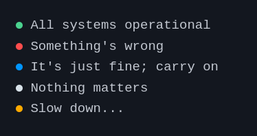

# &lt;status-indicator&gt; web component

Circles with colors. That's it. That's the component.

## Quick usage via CDN

Inside your HTML `<head>`:

```html
<head>
  <script type="module" src="https://esm.sh/@ayo-run/status-indicator"></script>
</head>
```

## Installation

```bash
# using npm
npm install @ayo-run/status-indicator

# or using pnpm
pnpm add @ayo-run/status-indicator
```

## Usage

Set the `status` property of the `status-indicator` component to any of the following: positive, negative, active, intermediary.

```html
<status-indicator status="positive"> All systems operational </status-indicator>
<status-indicator status="negative"> Something's wrong </status-indicator>
<status-indicator status="active"> It's just fine; carry on </status-indicator>
<status-indicator> Nothing matters </status-indicator>
<status-indicator status="intermediary"> Slow down... </status-indicator>
```

### Result



---

A project by _Ayo_
